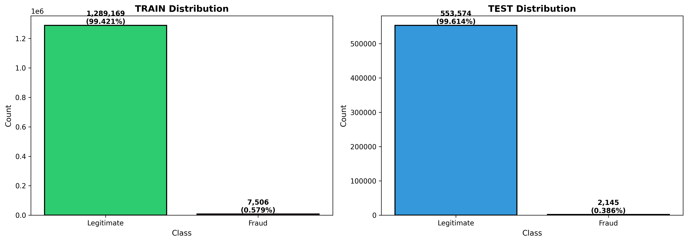

# Machine-Learning-for-Cybersecurity---Credit-Card-Fraud-Detection-

**Authors**

- Dylan Sansas 
- Maxime Thim-Siong
- Fabio Leboucher
- Mélissa Deffarges


----------


## Credit Card Detection - Project Overview

Credit card fraud detection is one of the most important applications of machine learning in finance today. Every year, billions are lost to fraudulent transactions. Therefore, the financial institutions need increasingly better solutions to fight this threat. However, building an effective fraud detection system is a hard task due to the imbalance in datasets. Fraudulent transactions are extremely rare compared to legitimates ones. In our dataset, only 0.6% of transactions are fraudulent, meaning that a model that predicts everything as legitimate would achieve 99.4% accuracy while being completely useless in reality. 

This project explores and compares four algorithms (Random Forest, LightGBM, XGBoost, and Gradient Boosting) for detecting fraudulent credit card transactions, evaluating their performance both with and without SMOTE.


----------


## Dataset

- **Source**: Kaggle Credit Card Fraud Detection Dataset
- **Size**: 1.3 millions transactions (training) + 555 thousands transactions (testing)
- **Features**: 73 (after the preprocessing)
- **Class Distribution**: 99.4% is legitimate and 0.6% is fraudulent 
- **Time Period**: January 2019 - June 2020

The dataset contains real credit card transactions with both legitimate and fraudulent cases. Each transaction includes information about the cardholder, merchant, transaction details, and location.

This data reflects the pratical challenges of fraud detection because, not only is fraud very rare, but it's also difficult to distinguish from legitimate outliers like travel or large purchases.

We can visualize how the dataset is balanced in the following histogram : 

<p align="center">
  
</p>


----------


## Project Structure
```
Machine-Learning-for-Cybersecurity---Credit-Card-Fraud-Detection-/
│
├── Visualization/                                       
│   ├── geographic_distance_analysis.png
│   ├── job_target_encoding_visualization.png
│   ├── category_target_encoding_visualization.png
│   └── class_imbalance.png
│
├── notebooks/                                           
│   ├── GradientBooting.ipynb                             # Gradient Boosting Classifier algorithm
│   ├── LightGBM.ipynb                                    # Light GBM Classifier algorithm
│   ├── RandomForest.ipynb                                # Random Forest Classifier algorithm
│   ├── XGBoost.ipynb                                     # XGBoost Classfier algorithm
│   ├── eda_analysis.ipynb                                # Analysis program
│   └── preprocessing_loader_v2.ipynb                     # Preprocessing program
│
├── main.ipynb                                            # Main program notebook
│
├── LICENSE                  
└── README.md                                             # Main project documentation
```

----------


## Requirements 

```
pandas>=1.3.0
numpy>=1.21.0
scikit-learn>=1.0.0
lightgbm>=3.3.0
xgboost>=1.5.0
matplotlib>=3.4.0
seaborn>=0.11.0
imbalanced-learn>=0.8.0
jupyter>=1.0.0
```


----------


## Methodology 

### 1. Data Preprocessing

Before applying any machine learning model, we needed to prepare the raw data. To do this, we followed those steps: 

**Feature Engineering** : We created neew features from the raw data to capture patterns that might indicate fraud.

    • Temporal Features: We extracted the hour of the day, day of the week, and wether the transaction occured on a weekend. These are important because fraud often happens at unusual times. 

    • Geographic Features: We calculated the distance between the customer's registered address and the merchant's location. The idea is that stolen cards might be used far from where it was stolen.

    • Demographic Features: We calculted the age of the customer since it can be linked to fraud risk (young adults and seniors are more susceptible to fall for a scam then a middle-age person)

**Categorical Encoding**: The dataset contained many categorical variables with thousands of unique values. So we chose to use three different encoding strategies depending on the feature's cardinality:

    • Label Encoding for binary variables (like gender: M→1, F→0)

    • One-Hot Encoding for moderate cardinality features (51 states)

    • Target Encoding for high-cardinality features (thousands of merchants), where we replaced each category with the average fraud rate for that category


**Normalization**: We normalized numerical features using **StandardScaled**, which transforms each features to have mean 0 and standard deviation 1. This ensures no feature will dominate due to its scale.


### 2. Handling Class Imbalance

The 172:1 imbalance ratio is the central problem in this project. Without addressing it, a model could achieve 99.4% accuracy by simply predicting "legitimate" for everything. To counter this, we decided to use 2 approaches and compare them to determine which one is the best. 

**Approach A : Class Weights Without Synthetic Data**

This approach tells the model to "care more" about fraud cases. To do that, it penalizes the errors on minority class more heavily by modifying their weight. 

By doing this, we get faster models and we work with the original data. However, the model only see about 0.6% of fraud examples during training, which might not be enough to capture all the fraud patterns.

**Approach B : SMOTE (Synthetic Minority Over-sampling Technique)**

Instead of reweighting, SMOTE generates synthetic fraud examples. Here's how it works : 

    1. For each real transaction, SMOTE finds its k-nearest fraud neighbors
    
    2. It creates new synthetic frauds by interpolating between these neighbors

    3. We set "sampling_strategy = 0.3" to create a roughly 3:1 imbalance (not 1:1 because this would not be realistic)

This generates about 300 000 synthetic fraud examples, giving the model more fraud to learn from. However, this makes the model slower.


### 3. The Four Models 

- **Random Forest**: An ensemble model used for classification and regression. It builds multiple decision trees using random subsets of the training data and random subsets of features at each split. The final prediction is determined by majority vote for classification or by averaging for regression.


- **Gradient Boosting**:  An ensemble model based on weak (shallow) decision trees combined sequentially, where each new tree is trained to correct the errors of the previous ones by following the gradient descent of a loss function.


- **XGBoost**: The XGBoost method is based on the construction of decision trees using the gradient boosting algorithm. The uniqueness of this algorithm lies in the structure of the decision trees employed. Trees whose branches produce inconsistent results are “pruned”; these are known as weak learners. Unlike Random Forest, XGBoost operates in a sequential manner. It utilizes multiple CPU cores so that learning can occur in parallel with training. XGBoost combines all the trees to enhance the accuracy of its predictions, making it particularly powerful for processing large volumes of data. Its strength lies in its bias reduction, achieved through the continuous improvement of parallel observations. Moreover, it requires no data preprocessing, as the algorithm directly includes built-in mechanisms to handle missing data, which greatly simplifies its implementation.


- **LightGBM**: Microsoft's alternative to XGBoost. It uses histograms instead of exact values and grows trees leaf-wise instead of level-wise. It is significantly faster than XGBoost but is more prone to overfitting.

<div style="display: flex; justify-content: center; width: 100%;">
  <table style="border-collapse: collapse; width: 80%; text-align: center;">
    <caption style="caption-side: top; font-weight: 600; padding: 4px 0; text-align: center;">
                            Models and their characteristics 
    </caption>
    <thead>
      <tr>
        <th style="border: 1px solid #d0d7de; padding: 8px;">Model</th>
        <th style="border: 1px solid #d0d7de; padding: 8px;">Algorithm</th>
        <th style="border: 1px solid #d0d7de; padding: 8px;">Key Strength</th>
        <th style="border: 1px solid #d0d7de; padding: 8px;">Temporal Complexity</th>
      </tr>
    </thead>
    <tbody>
      <tr>
        <td style="border: 1px solid #e6edf3; padding: 8px;">Random Forest</td>
        <td style="border: 1px solid #e6edf3; padding: 8px;">Parallel</td>
        <td style="border: 1px solid #e6edf3; padding: 8px;">Stability, interpretability</td>
        <td style="border: 1px solid #e6edf3; padding: 8px;">O(M⋅n⋅p⋅d)</td>
      </tr>
      <tr>
        <td style="border: 1px solid #e6edf3; padding: 8px;">LightGBM</td>
        <td style="border: 1px solid #e6edf3; padding: 8px;">Sequential</td>
        <td style="border: 1px solid #e6edf3; padding: 8px;">Speed, memory efficiency</td>
        <td style="border: 1px solid #e6edf3; padding: 8px;">O(M⋅(neff​⋅peff​+b⋅peff​⋅d))</td>
      </tr>
      <tr>
        <td style="border: 1px solid #e6edf3; padding: 8px;">XGBoost</td>
        <td style="border: 1px solid #e6edf3; padding: 8px;">Sequential</td>
        <td style="border: 1px solid #e6edf3; padding: 8px;">Accuracy, robustness</td>
        <td style="border: 1px solid #e6edf3; padding: 8px;">O(M⋅(n⋅p+b⋅p⋅d))
</td>
      </tr>
      <tr>
        <td style="border: 1px solid #e6edf3; padding: 8px;">Gradient Boosting</td>
        <td style="border: 1px solid #e6edf3; padding: 8px;">Sequential</td>
        <td style="border: 1px solid #e6edf3; padding: 8px;">Stability, simplicity</td>
        <td style="border: 1px solid #e6edf3; padding: 8px;">O(M⋅n⋅p⋅d)
</td>
      </tr>
    </tbody>
  </table>
</div>

With: 

    • n – number of samples (rows in the dataset)

    • p – number of features (columns)

    • M – number of trees in the ensemble

    • d – average or maximum depth of the trees

    • b – number of bins (for histograms, in XGBoost/LightGBM


    

### 4. Evaluation Metrics

- **Precision**: Shows how many transactions that were flagged as fraudulent actually were.

- **Recall**: Shows the percentage of fraud the model caught.

- **F1-Score**: The mean of precision and recall. Important because it allows us to see if our model is ignore false positives or false negatives.

- **PR-AUC (Precision-Recall - Area Under Curve)**: Shows the trade-off between precision and recall.

- **ROC-AUC (Receiver Operating Characteristic - Area Under Curve)**: Shows the trade-off between true positive rate and false positive rate.


----------


## Results 

This section presents the performances of the four evaluated models, comparing their effectiveness with and without the use of SMOTE.

### Model Performance Comparison

The models were trained with two methods:  

    • With class weights by using the original dataset and adjusting model weights to penalize misclassification of the fraud class more heavily.

    • With SMOTE by using a rebalanced dataset where synthetic fraud sample were generated via the SMOTE method.

The results are summarized below:

<div style="display: flex; justify-content: center; width: 100%;">
  <table style="border-collapse: collapse; width: 95%; text-align: center;">
    <caption style="caption-side: top; font-weight: 600; padding: 4px 0; text-align: center;">
      Model Performance on the Test Set
    </caption>
    <thead>
      <tr>
        <th style="border: 1px solid #d0d7de; padding: 8px;">Model</th>
        <th style="border: 1px solid #d0d7de; padding: 8px;">Balancing Strategy</th>
        <th style="border: 1px solid #d0d7de; padding: 8px;">PR-AUC</th>
        <th style="border: 1px solid #d0d7de; padding: 8px;">ROC-AUC</th>
        <th style="border: 1px solid #d0d7de; padding: 8px;">F1-Score</th>
        <th style="border: 1px solid #d0d7de; padding: 8px;">Recall</th>
        <th style="border: 1px solid #d0d7de; padding: 8px;">Precision</th>
      </tr>
    </thead>
    <tbody>
      <!-- Random Forest -->
      <tr>
        <td rowspan="2" style="border: 1px solid #e6edf3; padding: 8px; vertical-align: middle;">Random Forest</td>
        <td style="border: 1px solid #e6edf3; padding: 8px;">Class Weights</td>
        <td style="border: 1px solid #e6edf3; padding: 8px;">31.99%</td>
        <td style="border: 1px solid #e6edf3; padding: 8px;">95.09%</td>
        <td style="border: 1px solid #e6edf3; padding: 8px;">27.24%</td>
        <td style="border: 1px solid #e6edf3; padding: 8px;">75.02%</td>
        <td style="border: 1px solid #e6edf3; padding: 8px;">16.64%</td>
      </tr>
      <tr>
        <td style="border: 1px solid #e6edf3; padding: 8px;"><b>SMOTE</b></td>
        <td style="border: 1px solid #e6edf3; padding: 8px;"><b>31.82%</b></td>
        <td style="border: 1px solid #e6edf3; padding: 8px;"><b>93.78%</b></td>
        <td style="border: 1px solid #e6edf3; padding: 8px;"><b>28.96%%</b></td>
        <td style="border: 1px solid #e6edf3; padding: 8px;"><b>74.68%</b></td>
        <td style="border: 1px solid #e6edf3; padding: 8px;"><b>17.96%</b></td>
      </tr>
      <!-- LightGBM -->
      <tr>
        <td rowspan="2" style="border: 1px solid #e6edf3; padding: 8px; vertical-align: middle;">LightGBM</td>
        <td style="border: 1px solid #e6edf3; padding: 8px;">Class Weights</td>
        <td style="border: 1px solid #e6edf3; padding: 8px;">97.28%</td>
        <td style="border: 1px solid #e6edf3; padding: 8px;">99.93%</td>
        <td style="border: 1px solid #e6edf3; padding: 8px;">94.54%</td>
        <td style="border: 1px solid #e6edf3; padding: 8px;">92.87%</td>
        <td style="border: 1px solid #e6edf3; padding: 8px;">96.27%</td>
      </tr>
      <tr>
        <td style="border: 1px solid #e6edf3; padding: 8px;"><b>SMOTE</b></td>
        <td style="border: 1px solid #e6edf3; padding: 8px;"><b>97.59%</b></td>
        <td style="border: 1px solid #e6edf3; padding: 8px;"><b>99.96%</b></td>
        <td style="border: 1px solid #e6edf3; padding: 8px;"><b>94.33%</b></td>
        <td style="border: 1px solid #e6edf3; padding: 8px;"><b>90.41%</b></td>
        <td style="border: 1px solid #e6edf3; padding: 8px;"><b>98.62%</b></td>
      </tr>
      <!-- XGBoost -->
      <tr>
        <td rowspan="2" style="border: 1px solid #e6edf3; padding: 8px; vertical-align: middle;">XGBoost</td>
        <td style="border: 1px solid #e6edf3; padding: 8px;">Class Weights</td>
        <td style="border: 1px solid #e6edf3; padding: 8px;">96.67%</td>
        <td style="border: 1px solid #e6edf3; padding: 8px;">99.94%</td>
        <td style="border: 1px solid #e6edf3; padding: 8px;">91.94%</td>
        <td style="border: 1px solid #e6edf3; padding: 8px;">92.34%</td>
        <td style="border: 1px solid #e6edf3; padding: 8px;">91.55%</td>
      </tr>
      <tr>
        <td style="border: 1px solid #e6edf3; padding: 8px;"><b>SMOTE</b></td>
        <td style="border: 1px solid #e6edf3; padding: 8px;"><b>96.09%</b></td>
        <td style="border: 1px solid #e6edf3; padding: 8px;"><b>99.89%</b></td>
        <td style="border: 1px solid #e6edf3; padding: 8px;"><b>92.20%</b></td>
        <td style="border: 1px solid #e6edf3; padding: 8px;"><b>88.54%</b></td>
        <td style="border: 1px solid #e6edf3; padding: 8px;"><b>96.16%</b></td>
      </tr>
      <!-- Gradient Boosting -->
      <tr>
        <td rowspan="2" style="border: 1px solid #e6edf3; padding: 8px; vertical-align: middle;">Gradient Boosting</td>
        <td style="border: 1px solid #e6edf3; padding: 8px;">Class Weights</td>
        <td style="border: 1px solid #e6edf3; padding: 8px;">43.97%</td>
        <td style="border: 1px solid #e6edf3; padding: 8px;">92.13%</td>
        <td style="border: 1px solid #e6edf3; padding: 8px;">17.87%</td>
        <td style="border: 1px solid #e6edf3; padding: 8px;">10.93%</td>
        <td style="border: 1px solid #e6edf3; padding: 8px;">17.87%</td>
      </tr>
      <tr>
        <td style="border: 1px solid #e6edf3; padding: 8px;"><b>SMOTE</b></td>
        <td style="border: 1px solid #e6edf3; padding: 8px;"><b>34.87%</b></td>
        <td style="border: 1px solid #e6edf3; padding: 8px;"><b>95.07%</b></td>
        <td style="border: 1px solid #e6edf3; padding: 8px;"><b>53.32%</b></td>
        <td style="border: 1px solid #e6edf3; padding: 8px;"><b>59.89%</b></td>
        <td style="border: 1px solid #e6edf3; padding: 8px;"><b>48.05%</b></td>
      </tr>
    </tbody>
  </table>
</div>

Note that, due to time constraints and to the fact that we do not have access to NASA's pc, **LightGBM**'s and **XGBoost**'s were optimized with 50 iterations while **Random Forest** and **Gradient Boosting** were optimized with 15 iterations. However, this shows the efficiency of the optimization by optuna. 

 ## Comparative Analysis 

 - **XGBoost** 

 - **LightGBM** offered the best trade-off between speed and accuracy, making it a strong candidate for real-time systems where fast perdictions are essentials.

 - **Random Forest**

 - **Gradient Boosting**


 ## Visual Analysis 


----------


## Usage

To reproduce our results, run the **main.ipynb** notebook as it contains the complete pipeline: data loading, preprocessing, feature engienering, model training and evaluation. However, this might take long so if you want the results of only one models, you can simply run the notebook of the model. 


----------


## References 

- Lucas, Y., & Jurgovsky, J. (2020). Credit card fraud detection using machine learning: A survey. arXiv preprint arXiv:2010.06479.

- Akiba, T., Sano, S., Yanase, T., Ohta, T., & Koyama, M. (2019). Optuna: A Next-Generation Hyperparameter Optimization Framework. arXiv preprint arXiv:1907.10902

- Niu, X., Wang, L., & Yang, X. (2019). A Comparison Study of Credit Card Fraud Detection: Supervised versus Unsupervised. arXiv preprint arXiv:1904.10604

- Ghanem, M., Elkaffas, S. M., & Madbouly, M. Machine Learning Technique for Credit Card Fraud Detection

- Kochnev, R., Goodarzi, A. T., Bentyn, Z. A., Ignatov, D., & Timofte, R. (2025). Optuna vs Code Llama: Are LLMs a New Paradigm for Hyperparameter Tuning? arXiv preprint arXiv:2504.06006


